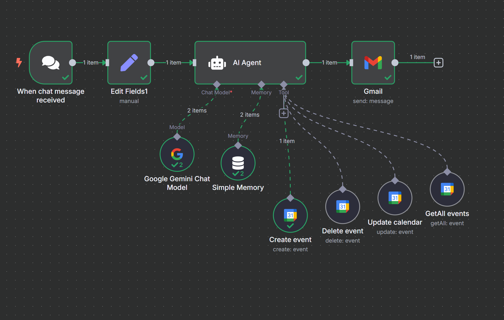

# 🤖 PFAI_Assignment#04 – n8n AI-Powered Calendar Automation

This project is an intelligent automation workflow built with [n8n](https://n8n.io/), integrating **Google Calendar**, **Google Gemini AI**, and **LangChain Agents**. It interprets chat-based inputs to perform smart calendar operations (create, update, delete, and retrieve events), and notifies users via Gmail.

---

## 📌 Features

- 🔁 **Chat-triggered workflow**
- 🧠 **AI-powered interpretation** using Google Gemini
- 📅 **Smart Calendar Management** via Google Calendar API
- 📧 **Automated email notifications**
- 💾 **Session memory handling** for contextual accuracy

---

## 🧩 Workflow Nodes

| Node Name             | Description                                               |
|-----------------------|-----------------------------------------------------------|
| `When chat message received` | Triggers the workflow from a new chat input |
| `Edit Fields1`        | Maps input text to a variable for processing              |
| `AI Agent`            | Core logic and decision-maker using LangChain & Gemini   |
| `Google Gemini Chat Model` | Language understanding model for natural language input |
| `Simple Memory`       | Maintains conversational state                           |
| `GetAll Events`       | Retrieves future calendar events                          |
| `Create Event`        | Adds a new event to Google Calendar                      |
| `Delete Event`        | Removes an event by ID                                    |
| `Update Calendar`     | Modifies an existing event                                |
| `Gmail`               | Sends email notifications with operation summaries        |

---

## 🚀 How It Works

1. A chat message is received.
2. The message is interpreted using AI to determine intent.
3. Based on the intent, an action is performed on Google Calendar:
   - **Create** a new event
   - **Update** an existing event
   - **Delete** an event
   - **Retrieve** upcoming events
4. A summary email is sent to the user.

---

## 🔧 Setup Instructions

1. Clone this repository.
2. Import the included `.json` file into your n8n instance.
3. Configure the required credentials:
   - Google Calendar OAuth2
   - Gmail OAuth2
   - Google Gemini API Key (PaLM)
4. Enable the workflow and test with a chat input.

---

## 📩 Contact

Created by **Umair Ahmed**  
Email: umairahmedf23@nutech.edu.pk

---

## 📄 License

This project is licensed under the MIT License.

---

## Workflow

---
